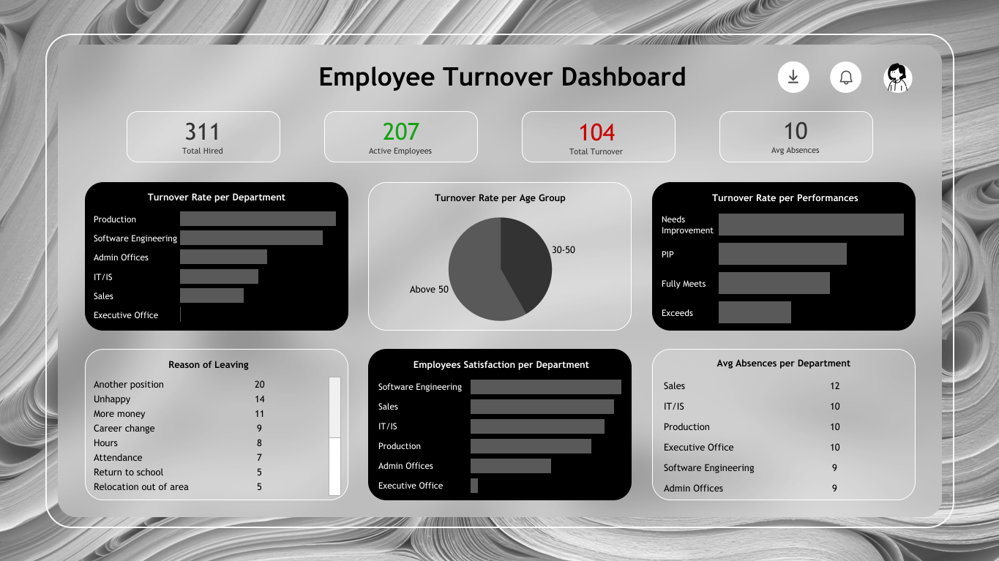

# HR Turnover Analysis Dashboard

## Project Overview
Employee turnover is a critical HR metric that can indicate dissatisfaction, burnout, or better opportunities elsewhere. This project aims to analyze employee turnover data to uncover patterns and provide actionable insights for improving employee retention. The dashboard provides a clear overview of key HR metrics including total hires, active employees, reasons for leaving, satisfaction levels, and turnover rates by department, age, and performance.

## Dataset Used
- <a href="https://github.com/adlathifa/HR_Turnover_Analysis/blob/main/dataset_hr_analytics.csv">Dataset</a>

## Key Questions

- Which departments experience the highest turnover?
- Are certain age groups more likely to leave?
- How does performance level relate to turnover?
- What are the common reasons employees leave the company?
- How satisfied are employees in different departments?
- Is there a relationship between absences and turnover?

## Process

1. **Data Cleaning**
   - Checked for duplicates

2. **Exploratory Data Analysis**
   - Aggregated turnover data by department, age group, and performance
   - Identified trends in reasons for leaving and satisfaction scores

3. **Dashboard Development**
   - Designed canvas using **Figma** for visual layout planning
   - Built interactive dashboard with **Tableau**.

## Dashboard Preview

- <a href="https://public.tableau.com/app/profile/annisa.aufa.dina.lathifa/viz/HRTurnoverAnalysis_17462643352280/Dashboard1?publish=yes"> Interaktive Dashboard</a>

## Insights & Recommendation

#### 1. High Turnover in Production and Software Engineering  
These departments show the highest turnover rates.  
**Recommendation:** Investigate underlying causes and develop focused strategies to improve retention.

#### 2. Employees Aged Above 50 Have the Highest Turnover Rate (42.2%)  
Employees over 50 are most likely to leave the company.  
**Recommendation:** Offer flexible work options, mentoring roles, or phased retirement plans.

#### 3. Employees Aged 30–50 Contribute the Most to Turnover Volume (30.3%)  
This group makes up the majority of total turnover cases.  
**Recommendation:** Focus on career development, promotions, and work-life balance.

#### 4. “Needs Improvement” Performance Rating Linked to Turnover  
These employees are more likely to resign.  
**Recommendation:** Launch coaching/mentoring initiatives before they disengage.

#### 5. Most Employees Leave for a Better Opportunity  
Better external offers are the top reason for leaving.  
**Recommendation:** Create clear career paths and growth programs, especially in high-risk departments.

#### 6. Lowest Satisfaction in Executive Office  
Satisfaction scores are the lowest in this department.  
**Recommendation:** Run deep-dive surveys or open forums to address internal issues.

#### 7. Absenteeism Correlates with Turnover  
Higher absence rates align with higher resignation risk.  
**Recommendation:** Use absenteeism data as an early warning. Provide health, mental wellness, and flexible work support.

### Author
---
Annisa Aufa - <a href="https://github.com/adlathifa">Github Profile</a>
